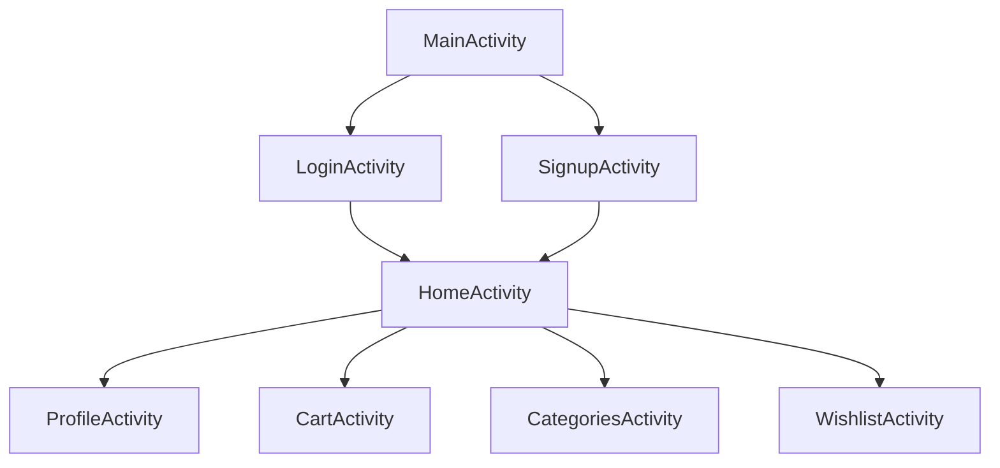
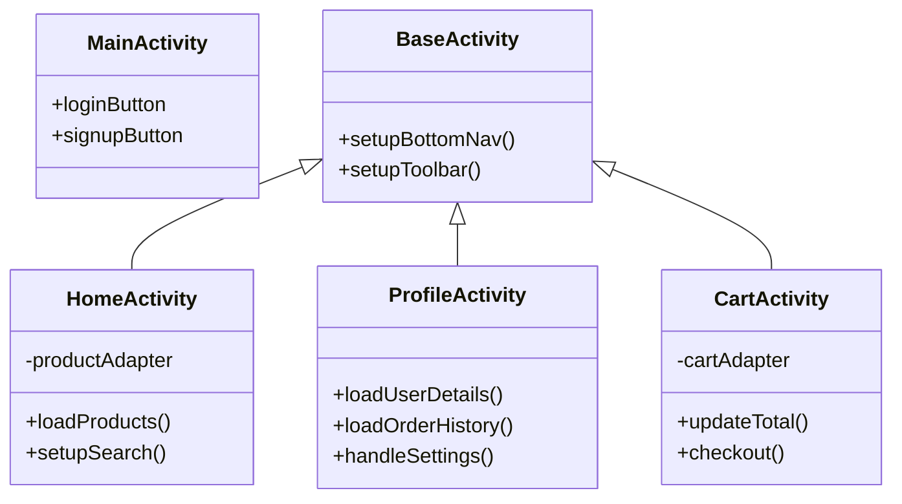

# Shop App Implementation Plan

## Navigation Structure

## Page Designs

### 1. Home Page
- Bottom navigation bar for easy access to all sections
- RecyclerView grid showing product cards
- Search bar at the top
- Featured products carousel
- Categories quick access
- Each product card shows:
  * Product image
  * Name
  * Price
  * Add to cart button
  * Wishlist button

### 2. Profile Page
- User profile section with avatar and basic info
- Settings section:
  * Account settings
  * Notification preferences
  * Address management
  * Payment methods
- Order history section:
  * List of past orders
  * Order status tracking
  * Order details view

### 3. Shopping Cart Page
- List of items in cart
- Quantity adjusters
- Price summary
- Remove item option
- Checkout button
- Empty cart state handling

### 4. Categories Page
- Grid of product categories
- Sub-categories support
- Category-specific product listings
- Filtering and sorting options

### 5. Wishlist Page
- Saved/favorited items
- Add to cart option
- Remove from wishlist
- Share wishlist feature

## Technical Architecture

## Data Management
- Room database for local storage
- SharedPreferences for user settings
- Retrofit for API communication
- LiveData and ViewModel for reactive UI updates

## UI/UX Considerations
- Material Design 3 components
- Consistent color scheme and typography
- Smooth transitions between pages
- Loading states and error handling
- Pull-to-refresh functionality
- Offline support

## Additional Features
- Product search and filtering
- Push notifications for orders
- Share products functionality
- Rating and review system
- Order tracking