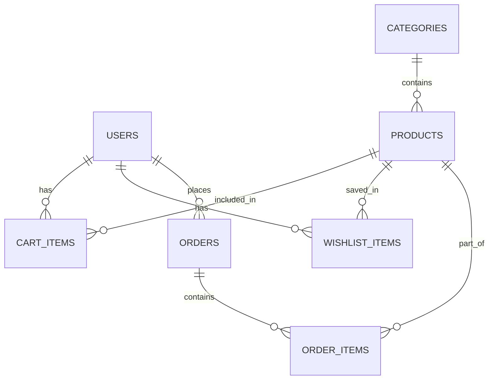

# SQLite Implementation Plan

## Database Schema

### Tables Overview


### Tables Structure

#### 1. Users Table
```sql
CREATE TABLE users (
    id INTEGER PRIMARY KEY AUTOINCREMENT,
    name TEXT NOT NULL,
    email TEXT UNIQUE NOT NULL,
    password TEXT NOT NULL,
    created_at DATETIME DEFAULT CURRENT_TIMESTAMP
)
```

#### 2. Categories Table
```sql
CREATE TABLE categories (
    id INTEGER PRIMARY KEY AUTOINCREMENT,
    name TEXT NOT NULL,
    description TEXT,
    image_url TEXT
)
```

#### 3. Products Table
```sql
CREATE TABLE products (
    id INTEGER PRIMARY KEY AUTOINCREMENT,
    name TEXT NOT NULL,
    description TEXT,
    price REAL NOT NULL,
    image_url TEXT,
    category_id INTEGER NOT NULL,
    stock_quantity INTEGER NOT NULL DEFAULT 0,
    created_at DATETIME DEFAULT CURRENT_TIMESTAMP,
    FOREIGN KEY(category_id) REFERENCES categories(id)
)
```

#### 4. Cart Items Table
```sql
CREATE TABLE cart_items (
    id INTEGER PRIMARY KEY AUTOINCREMENT,
    user_id INTEGER NOT NULL,
    product_id INTEGER NOT NULL,
    quantity INTEGER NOT NULL DEFAULT 1,
    added_at DATETIME DEFAULT CURRENT_TIMESTAMP,
    FOREIGN KEY(user_id) REFERENCES users(id),
    FOREIGN KEY(product_id) REFERENCES products(id)
)
```

#### 5. Wishlist Items Table
```sql
CREATE TABLE wishlist_items (
    id INTEGER PRIMARY KEY AUTOINCREMENT,
    user_id INTEGER NOT NULL,
    product_id INTEGER NOT NULL,
    added_at DATETIME DEFAULT CURRENT_TIMESTAMP,
    FOREIGN KEY(user_id) REFERENCES users(id),
    FOREIGN KEY(product_id) REFERENCES products(id)
)
```

#### 6. Orders Table
```sql
CREATE TABLE orders (
    id INTEGER PRIMARY KEY AUTOINCREMENT,
    user_id INTEGER NOT NULL,
    total_amount REAL NOT NULL,
    status TEXT NOT NULL,
    shipping_address TEXT NOT NULL,
    order_date DATETIME DEFAULT CURRENT_TIMESTAMP,
    FOREIGN KEY(user_id) REFERENCES users(id)
)
```

#### 7. Order Items Table
```sql
CREATE TABLE order_items (
    id INTEGER PRIMARY KEY AUTOINCREMENT,
    order_id INTEGER NOT NULL,
    product_id INTEGER NOT NULL,
    quantity INTEGER NOT NULL,
    price_at_time REAL NOT NULL,
    FOREIGN KEY(order_id) REFERENCES orders(id),
    FOREIGN KEY(product_id) REFERENCES products(id)
)
```

## Sample Data

### Categories
1. Electronics
   - Gadgets and electronic devices
   - Sample products: Smartphones, Laptops

2. Clothing
   - Fashion and apparel
   - Sample products: T-shirts, Jeans

3. Books
   - Books and literature
   - Sample products: Novels, Textbooks

4. Home & Kitchen
   - Home appliances and kitchen essentials
   - Sample products: Coffee Makers, Blenders

### Products
- Electronics:
  * Smartphone X ($699.99)
  * Laptop Pro ($1,299.99)

- Clothing:
  * Classic T-Shirt ($19.99)
  * Denim Jeans ($49.99)

- Books:
  * The Great Novel ($14.99)

- Home & Kitchen:
  * Coffee Maker ($79.99)

### Sample Users
1. John Doe
   - Email: john@example.com
   - Cart: Smartphone X, Classic T-Shirt (2x)
   - Wishlist: Laptop Pro, Coffee Maker

2. Jane Smith
   - Email: jane@example.com
   - Cart: The Great Novel
   - Wishlist: Denim Jeans

3. Admin User
   - Email: admin@example.com

### Sample Orders
1. John's Order:
   - Total: $719.98
   - Status: DELIVERED
   - Items: 
     * 1x Smartphone X ($699.99)
     * 1x Classic T-Shirt ($19.99)

2. Jane's Order:
   - Total: $94.98
   - Status: SHIPPED
   - Items:
     * 1x The Great Novel ($14.99)
     * 1x Coffee Maker ($79.99)

## Model Classes

### 1. User Model
- Basic user information
- Authentication details
- Account creation timestamp

### 2. Product Model
- Product details
- Stock management
- Category association
- Pricing information

### 3. Category Model
- Category information
- Product organization
- Navigation structure

### 4. CartItem Model
- Shopping cart functionality
- Quantity management
- Product reference
- User association

### 5. WishlistItem Model
- Wishlist functionality
- Product reference
- User association

### 6. Order Model
- Order management
- Status tracking
- Shipping information
- Total amount calculation

### 7. OrderItem Model
- Order line items
- Historical pricing
- Quantity tracking

## Database Helper Methods

### User Operations
- `addUser(User user)`
- `getUser(String email)`
- `validateUser(String email, String password)`
- `isEmailExists(String email)`

### Product Operations
- `getProductsByCategory(long categoryId)`
- `getProduct(long productId)`

### Category Operations
- `getAllCategories()`

### Cart Operations
- `getCartItems(long userId)`

### Wishlist Operations
- `getWishlistItems(long userId)`

### Order Operations
- `getUserOrders(long userId)`
- `getOrderItems(long orderId)`

## Data Relationships

1. One-to-Many Relationships:
   - User → Cart Items
   - User → Wishlist Items
   - User → Orders
   - Category → Products
   - Order → Order Items

2. Many-to-One Relationships:
   - Products → Category
   - Cart Items → User
   - Cart Items → Product
   - Wishlist Items → User
   - Wishlist Items → Product
   - Orders → User
   - Order Items → Order
   - Order Items → Product

## Implementation Notes

1. Database Version Management:
   - Current version: 1
   - Version upgrades handle table recreation

2. Foreign Key Constraints:
   - Enforced for data integrity
   - Cascading deletes not implemented (manual cleanup required)

3. Timestamps:
   - Automatic creation timestamps
   - SQLite CURRENT_TIMESTAMP used

4. Caching:
   - Product details cached in cart/wishlist/order items
   - Reduces need for multiple queries

5. Status Management:
   - Order status constants defined
   - Status flow: PENDING → CONFIRMED → SHIPPED → DELIVERED

6. Price Handling:
   - Current prices stored in products table
   - Historical prices stored in order_items for order integrity

7. Stock Management:
   - Stock quantity tracked in products table
   - Updates required on order placement/cancellation