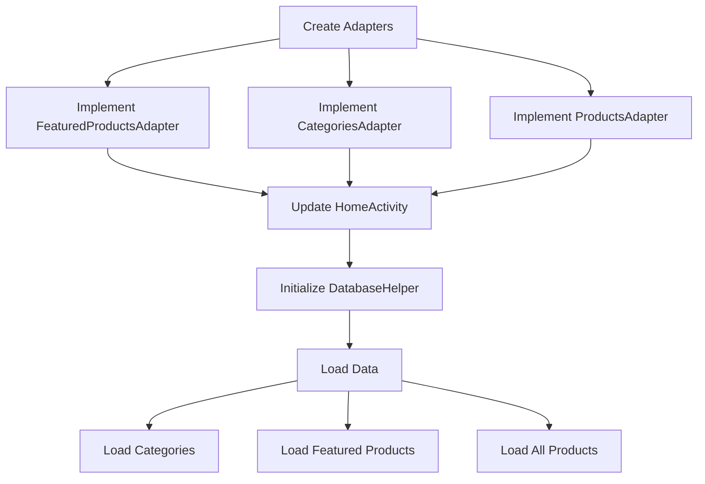
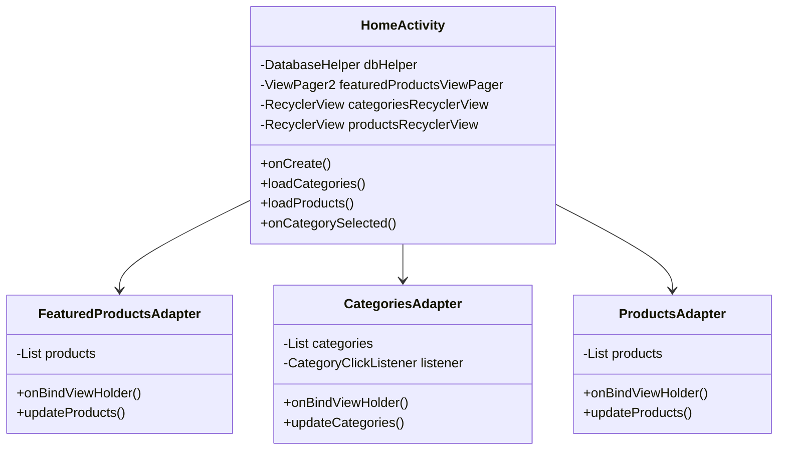

# UI Data Loading Implementation Plan

## Problem Analysis
The current HomeActivity has placeholders for adapters but no actual data loading implementation. The DatabaseHelper class provides all necessary methods to fetch data, but they are not being utilized.

## Solution Architecture

## Implementation Steps

### 1. Create Adapters Package
- Create new package `com.example.myapplication.adapters`
- Implement adapters:
  * `FeaturedProductsAdapter.java` - For ViewPager2
  * `CategoriesAdapter.java` - For RecyclerView
  * `ProductsAdapter.java` - For RecyclerView

### 2. Update HomeActivity
- Initialize DatabaseHelper instance
- Load initial data:
  * Categories using `getAllCategories()`
  * Products using `getProductsByCategory()`
- Set up adapters with data
- Initialize ViewPager and RecyclerViews with adapters
- Implement category selection to filter products

### 3. Data Flow
- On activity creation:
  * Load all categories
  * Display first category's products by default
- On category selection:
  * Filter products for selected category
  * Update products RecyclerView
- Featured products:
  * Select subset of products for featured display
  * Update ViewPager with featured items

### 4. Class Structure

## Dependencies
- Android RecyclerView
- Android ViewPager2
- SQLite Database (via DatabaseHelper)

## Expected Outcome
- Categories displayed horizontally at top
- Featured products in ViewPager2 slideshow
- Grid of products below categories
- Products filtered by selected category
- Smooth data loading and updates

## Error Handling
- Handle empty states for categories and products
- Add loading indicators during data fetch
- Implement error states for failed data loading